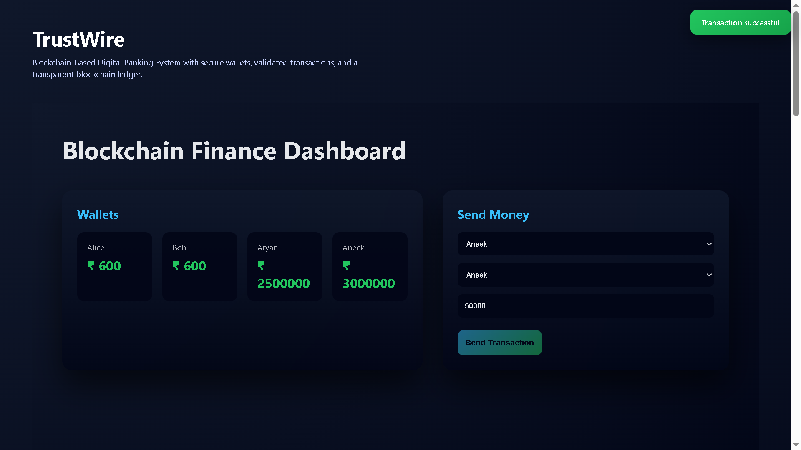
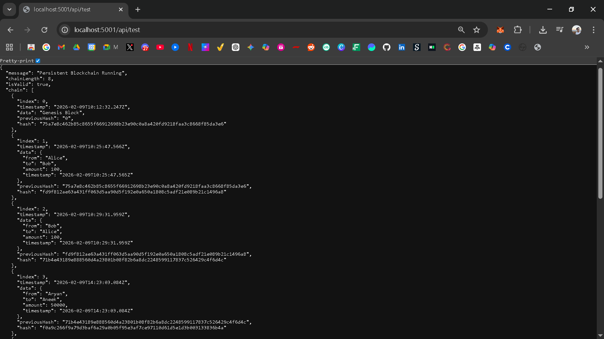
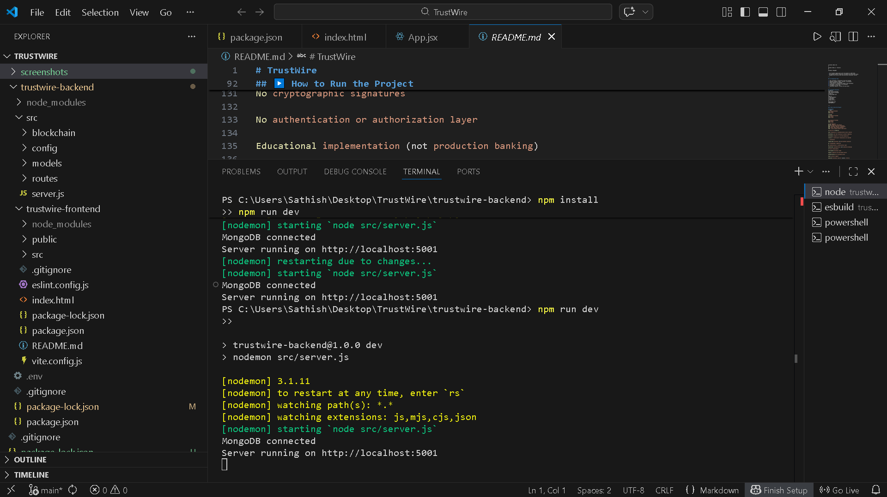

# TrustWire  
## Blockchain-Based Digital Banking System

TrustWire is a full-stack blockchain-based digital banking system that enables
secure wallet management, validated peer-to-peer transactions, and transparent
transaction tracking using a custom blockchain ledger.

The system combines traditional banking logic with blockchain principles such as
immutability, hash chaining, and transaction transparency, all presented through
a modern web-based dashboard.

---

## 🚀 Features

- Digital wallets with balance management  
- Secure fund transfers with balance validation  
- Custom blockchain implementation  
- Immutable transaction ledger  
- Persistent blockchain storage using MongoDB  
- Real-time blockchain explorer  
- Modern, fintech-style user interface  

---

## 🛠 Tech Stack

### Backend
- Node.js  
- Express.js  
- MongoDB (Mongoose)  
- Custom Blockchain Engine  
- SHA-based hashing  

### Frontend
- React (Vite)  
- Axios  
- Modern CSS (dark UI with gradients)  

---

## 🧱 System Architecture

Frontend (React UI)  
↓  
Backend (Node.js + Express)  
↓  
Database (MongoDB)  

- REST-based communication between frontend and backend  
- Backend enforces transaction validation and blockchain logic  
- MongoDB persists wallets and blockchain blocks  

---

## 🔄 Transaction Flow

1. User initiates a transaction from the frontend  
2. Backend validates sender, receiver, and balance  
3. Wallet balances are updated  
4. A new block is created and linked to the blockchain  
5. Blockchain is persisted to the database  
6. UI updates in real time  
7. Blockchain Explorer reflects the new block  

---

## 📁 Project Structure

```text
TrustWire/
├── README.md
├── screenshots/
├── trustwire-backend/
│   ├── src/
│   │   ├── blockchain/
│   │   ├── models/
│   │   ├── routes/
│   │   └── server.js
│   └── package.json
└── trustwire-frontend/
    ├── src/
    ├── public/
    └── package.json
```

---

## ▶️ How to Run the Project 

### Backend

```bash
cd trustwire-backend
npm install
npm run dev
```

Runs on http://localhost:5001

### Frontend

```bash
cd trustwire-frontend
npm install
npm run dev
```

Runs on http://localhost:5173

---

## 🌐 API Endpoints

| Method | Endpoint      | Description               |
|------|---------------|---------------------------|
| GET  | /api/test     | Fetch full blockchain     |
| POST | /api/add      | Perform a transaction     |
| GET  | /users        | Fetch wallet balances     |
| POST | /users/create | Create a new wallet       |

---

## 🔐 Security & Integrity

- Pre-transaction validation before block creation  
- Hash chaining prevents data tampering  
- Blockchain integrity verified dynamically  
- Invalid transactions are rejected  

---

## ⚠️ Limitations

- Single-node blockchain (no distributed consensus)  
- No cryptographic signatures  
- No authentication or authorization  
- Educational prototype only  

---

## 🔮 Future Enhancements

- Distributed blockchain nodes  
- Digital signatures and wallets  
- Authentication & RBAC  
- Smart contracts  
- Advanced explorer & analytics  

---

## 📸 Project Screenshots

### Full Dashboard Overview


### Wallets (Before Transaction)


### Wallets (After Transaction)


### Transaction Success Notification


### Blockchain Explorer


### Backend API – Blockchain Data


### Backend Server Running


## 🧩 System Design Diagrams

### System Architecture Diagram


### Transaction Sequence Diagram


